# Getting started

Code is just text on a page, so you could use a default text editor like 'Notepad' on Windows or 'TextEdit' on a mac, but it's easier to read and notice mistakes with better text editors that colour code the text according to the coding language.

1. Download a text editor if you don't have one. [Visual Studio code](https://code.visualstudio.com/) is a good one for both Windows and Mac.

2. Download the files above by clicking the green button and selecting 'download zip'.

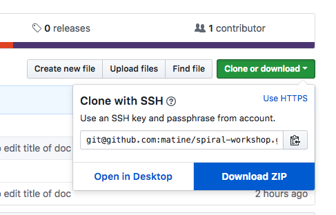

3. There are a few web browsers out there but Google Chrome is an easy one to work with and has built in developer tools. You can download it [here](https://www.google.co.uk/chrome/) if you don't already have it.

4. Open the `index.html` file in your web browser to see the webpage.

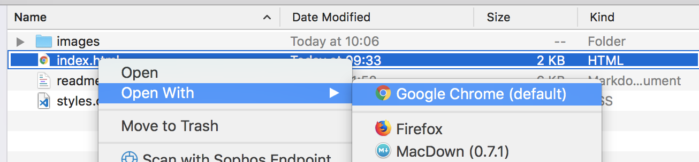

5. In Google Chrome you can use the developer tools to inspect the webpage.

Right click on the page and click `inspect`.

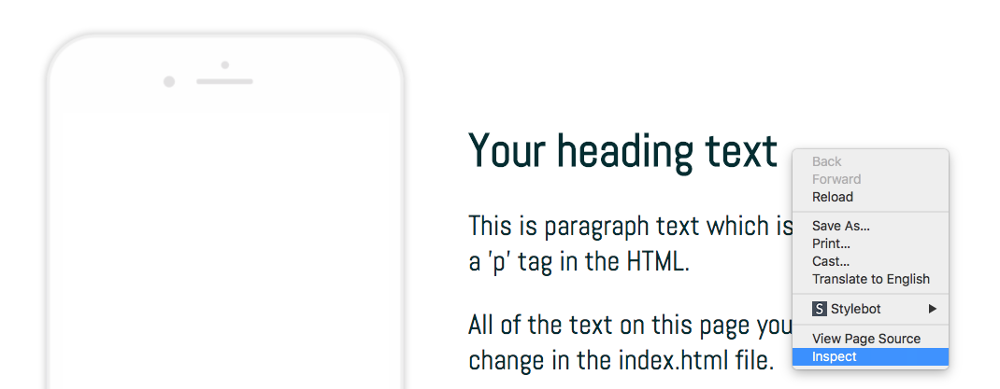

You can now see and explore the HTML and CSS of the page (or any webpage).

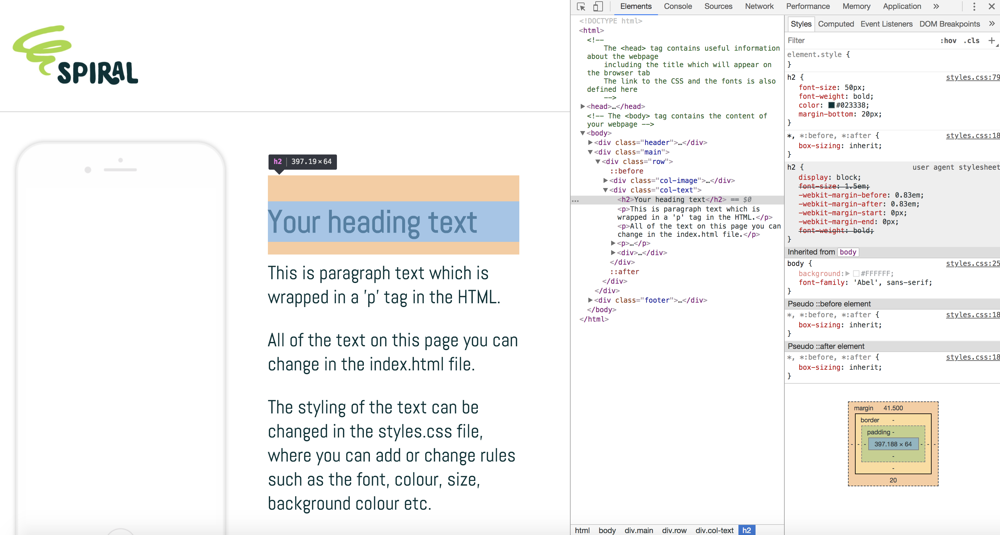

4. Open the `index.html` and `style.css` files in a text editor as you will be working on them.

**Note:** The `index.html` file is the content of your webpage. When it's open in a browser it looks like a webpage and when it's open in a text editor (like Visual Studio code) it shows the code that creates the webpage.

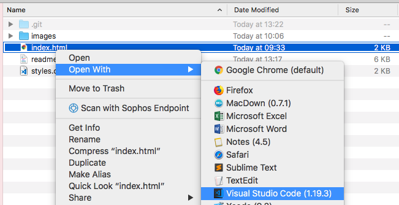

5. **Remember!** Any time you make a change to either file, you will need to save it (file save in Visual Studio Code) and then refresh the screen in the browser to see it take effect.

---

# HTML and CSS explained

## The HTML

The `index.html` is the content of your webpage.

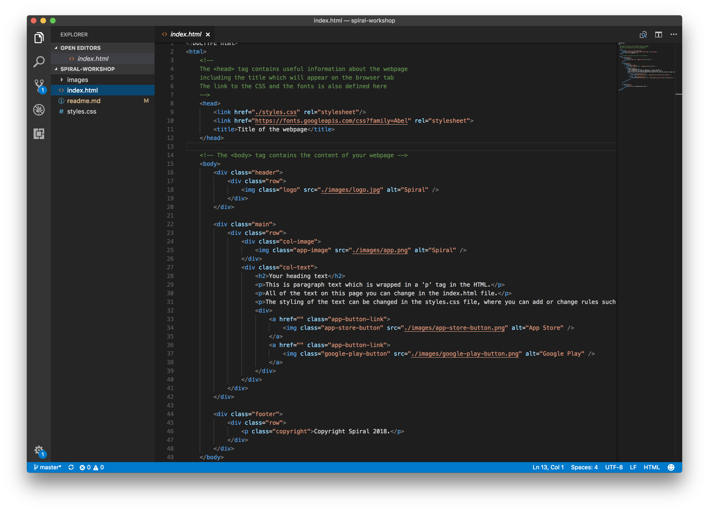

Light background reading:

[Basic HTML structure explained](https://www.w3schools.com/html/html_basic.asp)

[HTML elements explained](https://www.w3schools.com/html/html_elements.asp)

[HTML attributes explained](https://www.w3schools.com/html/html_attributes.asp)

HTML elements are represented by tags in the HTML for example a body tag will wrap the entire page and starts like this `<body>` and ends with this `</body>`.

Attributes are additional information given to a HTML element and they start with the attribute name eg `src` (source of the image) and an equals sign `=` and `""` which contains the path to where the image is located.

The HTML elements we are using in this template are:

* `<body>`...`</body>` - A body tag wraps the page content (only ever one on a page) 
* `
`...`
` - div tags are used all the time to wrap anything
* `<h2>`...`</h2>` - h2 (heading 2) tag is for a heading
* `
`...`
` - p (paragraph) tag is for general text
* `<a href="/path/to/link">`...`</a>` - an 'a' (link) tag can wrap text or an image and the location of the link should be set in the `href` attribute.
* `` - img (image) tags are self closing and the location of the image needs to be set in the `src` attribute.

## The CSS

The `styles.css` file contains the styling for your webpage.

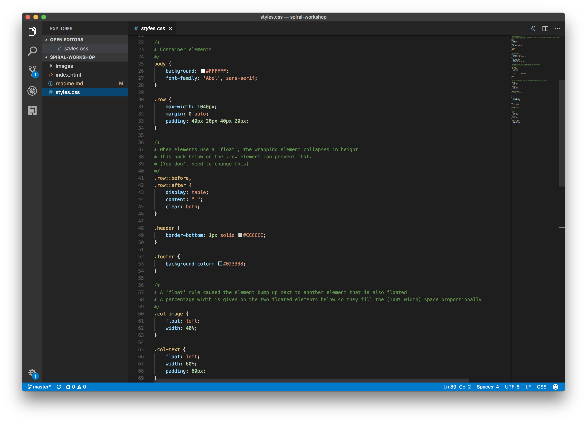

Each set of style rules corresponds to a HTML element, which can either be targetted by the tagname eg. `
` in the HTML would be `p` followed by an opening brace `{` ... the list of style rules ... and then a closing brace `}` in the CSS.

Or if you need to be more specific, you can add a 'class' attribute to the HTML element eg. `
` here a classname 'copyright' has been added to the 'p' element. And in the styles you would use a dot to signify it is a class like so `.copyright`.

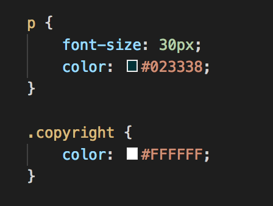

In the example above, all text wrapped in a `
` tag will be the dark green colour and 30px in size. But the text in the `
` that has the class attribute called 'copyright' will be the white in colour. This is because you are targeting it specifically by class name which has a stronger effect.

---

# Your tasks

### Add your own logo

* Put your cut out logo in the images folder.

The image files will need to be `.png` or `.jpg`.

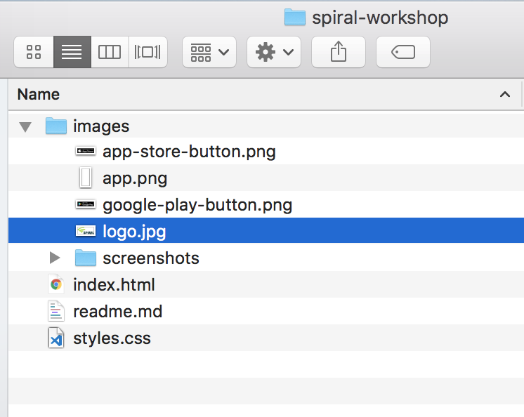

* In the HTML file, find where the current logo is `` and replace the file name `logo.jpg` with your own, and also the `alt` attribute text with the name and slogan (this will be hidden but is needed for accessibility and SEO etc).

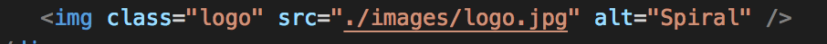

* In the CSS file, find where it says `.logo` - these are the style rules that define what the logo looks like on the page. You can change the width here to suit your logo.

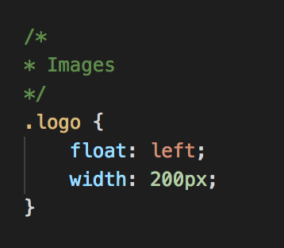

### Add your own app image

* Same steps as above for the app image. Can you work it out?

### Add your own text content

* Find the text in the HTML which will be wrapped in `
` and `<h2>` tags, and replace with your own content. So this should be the heading, text and copyright text.
* You should also change the title of the page (which appears on the tab of the browser window). This is wrapped in a `<title>` tag near the top of the index.html.

### Add your own font

* Find a font you like from [Google web fonts](https://fonts.google.com/)

For example the 'Lobster' font.

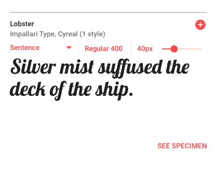

* Click on the red plus icon, the font will appear in a black box at the bottom. Click the box to view the font you have selected (making sure it is just one font).

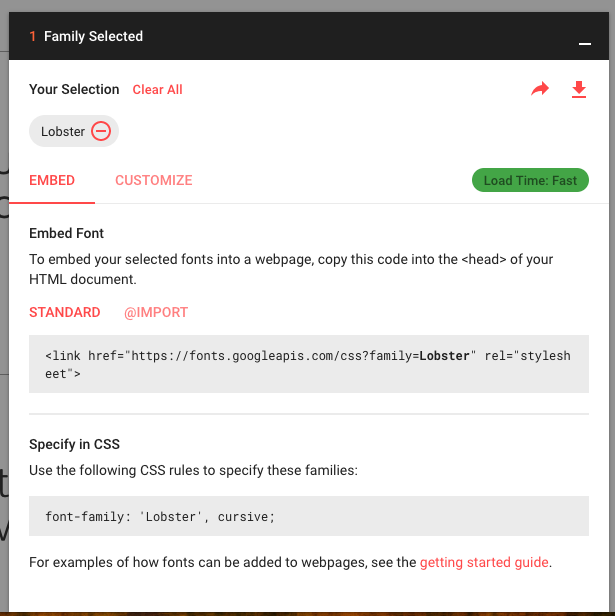

* It gives code snippets for both the HTML and the CSS. Find the similar code snippets in this template and replace with your own.

In your `index.html` you will currently have...

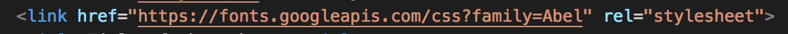

In your `styles.css` you will currently have...

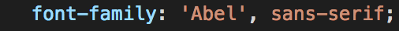

### Have a play with styling of the page...

[Lists of style rules](https://www.w3schools.com/css/default.asp) - links on the left

The main styles we will be changing are:

* `color` : #000000; (applies to text)
* `background-color` : #FFFFFF; (applies to the background colour)
* `font-size` : 14px;
* `width` : 100px; (can be px or %)
* `height` : 200px; (if the width is set, the height doesn't usually need to be)
* `border-bottom` : 1px dotted #CCCCCC (3 values should be given - thickness, type of border, colour)

### Extra task - add fake links for the Apple Store and Google Play buttons

These links are created by and image wrapped by a link tag `<a>` and the link needs to be set in the `href` attribute on the links.

* Can you add links to these in the HTML and see them working?

### Further learning

[A list of learning resources](https://github.com/Nezteb/Teaching_WebDev)